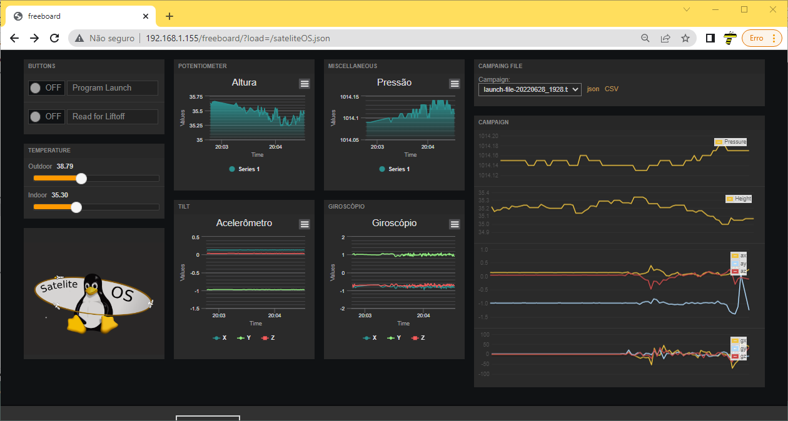
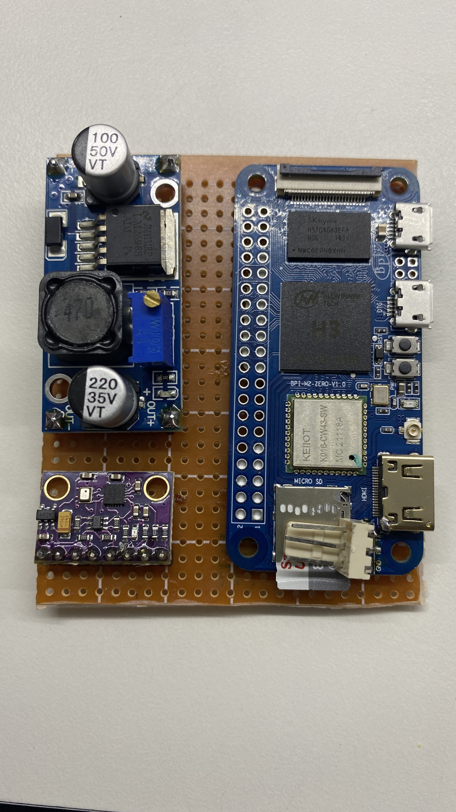
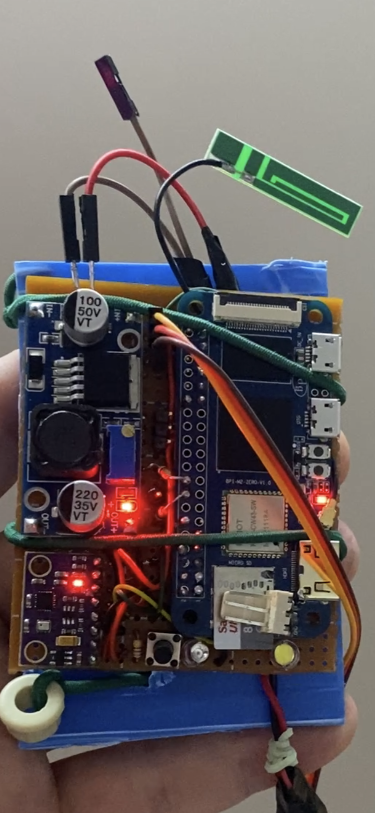
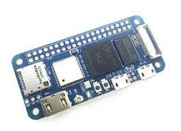
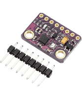
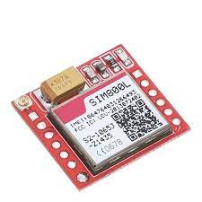
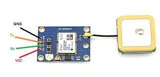

# Satelite OS
Satelite OS is a complete solution of hardware and software that offer sensors, communication, interface and software libraries for those who wants to develop techologies for rockets, satelites and metereological baloons.  
To collect in real time all sensors we have a web interface that show all data available from sensors and also trigger the state to launch or scrub. When in launch mode all data is saved in a file and will offer a complete set of data from ground to apogee and landing.  
An algorithm detects apogee be reading accelerometers em looking for microgravity (near zero G) that happens when a rocket reach maximum height. After that the algorithm starts looking for spike in acceleration reading that happens in lading phase.  
  
  
  The solution has a web interface and is a ready to launch mission for rockets. When power on, the system enters in a launch mode and stores data
of sensors by an algorithm that detects apogy and landing, creating campains for future analisys. To power this system we use a set of 7 AAA bateries. The complete weight of hardware and batteries is around 165g. 
The hardware may be based on Raspberry Pi Zero V2 running Linux or Banana PI M2 Zero. A module called GY-91 that combines MPU9250 and BMP280 offers accelerometer, digital compass, gyroscope, barometric pressure and temperature readings. 
  
 
 
A GSM module (SIM800L) can be useful for balloons that can travel long distances sending sms to inform data from sensors like location, high and many other parameters.
  
The last module is the GPS (NEO6M) offering location and global time to help register the location. 
 

