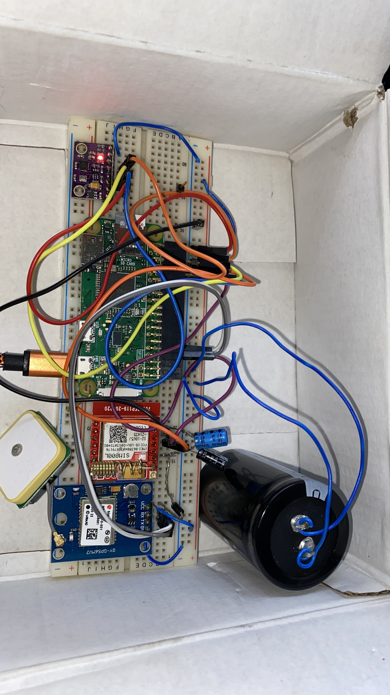
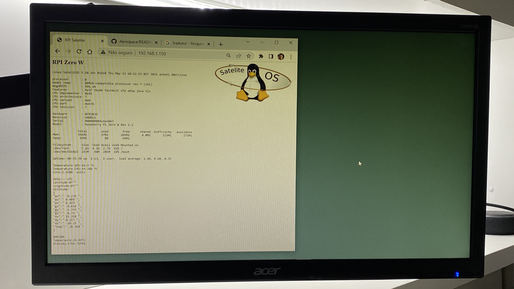

Satelite OS is a complete solution of hardware and software that offer sensors, communication, interface and software libraries for those who wants to develop techologies for rockets, satelites and metereological baloons.
  
  
The hardware is based on Raspberry Pi Zero V2 running Linux. A module called GY-91 that combines MPU9250 and BMP280 offers accelerometer, digital compass, gyroscope and  barometric pressure readings. 
  
 
A GSM module (SIM800L) can be useful for balloons that can travel long distances sending sms to inform data from sensors like location, high and many other parameters.
  
The last module is the GPS (NEO6M) offering location and global time to help register the location. 
 

